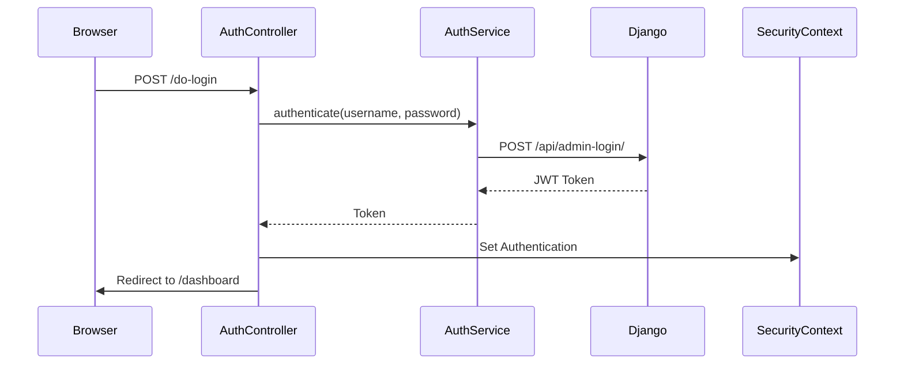

# Estructura del Proyecto ParkeaYa Panel Local

## Estructura de Directorios
```
local-paneladmi/
├── src/
│   ├── main/
│   │   ├── java/
│   │   │   └── com/
│   │   │       └── parkeaya/
│   │   │           └── local_paneladmi/
│   │   │               ├── Config/
│   │   │               │   ├── ApiConfig.java
│   │   │               │   ├── JwtAuthenticationFilter.java
│   │   │               │   ├── SecurityConfig.java          # Configuración Spring Security
│   │   │               │   ├── ThymeleafConfig.java
│   │   │               │   └── WebConfig.java
│   │   │               ├── controller/
│   │   │               │   ├── AuthController.java          # Manejo de login/logout
│   │   │               │   ├── CustomErrorController.java   # Páginas de error personalizadas
│   │   │               │   ├── OwnerDashboardController.java # Dashboard principal
│   │   │               │   └── DashboardController.java     # (Legacy, redirige a OwnerDashboard)
│   │   │               ├── model/
│   │   │               │   ├── dto/
│   │   │               │   │   └── UserDTO.java            # DTO para datos de usuario
│   │   │               │   ├── entity/                     # Entidades JPA
│   │   │               │   └── enums/                      # Enumeraciones
│   │   │               ├── service/
│   │   │               │   ├── AuthService.java            # Autenticación contra Django
│   │   │               │   └── DashboardService.java       # Lógica del dashboard
│   │   │               └── LocalPaneladmiApplication.java  # Clase principal
│   │   └── resources/
│   │       ├── static/
│   │       │   ├── css/
│   │       │   │   ├── dashboard.css
│   │       │   │   └── style.css
│   │       │   ├── js/
│   │       │   │   ├── dashboard.js
│   │       │   │   └── parking-management.js
│   │       │   └── images/
│   │       ├── templates/
│   │       │   ├── auth/
│   │       │   │   └── login.html                        # Formulario de login
│   │       │   ├── dashboard/
│   │       │   │   └── index.html                        # Vista principal del dashboard
│   │       │   ├── error/
│   │       │   │   └── error.html                        # Plantilla de errores
│   │       │   └── fragments/
│   │       │       ├── header.html
│   │       │       ├── footer.html
│   │       │       └── sidebar.html
│   │       └── application.properties                    # Configuración de la aplicación
│   └── test/
└── pom.xml                                              # Dependencias Maven
```

## Flujo de Autenticación


## Endpoints Principales
- `/login` - Página de inicio de sesión
- `/do-login` - Procesamiento de login
- `/dashboard` - Dashboard principal
- `/logout` - Cierre de sesión

## Seguridad
- CSRF deshabilitado (usando JWT)
- Rutas públicas: /login, /do-login, recursos estáticos
- Rutas protegidas: /dashboard y resto
- Autenticación mediante JWT contra backend Django

## Servicios
- `AuthService`: Maneja autenticación contra Django
- `DashboardService`: Lógica de negocio del dashboard

## Plantillas Thymeleaf
- Layout base con fragmentos reutilizables
- Páginas principales: login, dashboard, error